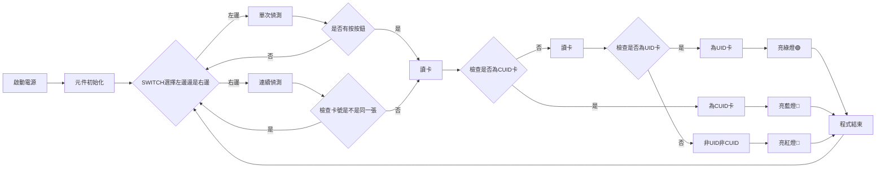

# chinese-magic-card-detector
Using arduino and PN532 create a UID(chinese magic card gen 1) and CUID(chinese magic card gen 2) card detector. 
## 軟體
### 前言
這邊使用[SigmaDolphin的Adafruit-PN532分支](https://github.com/SigmaDolphin/Adafruit-PN532)，SigmaDolphin有提出PR但是一直未獲merge，其做了UID(gen 1)卡偵測的改動，新增了以下

public funtion : `UnlockBackdoor()`

private function : `WriteRegister(uint8_t *reg, uint8_t len)`、`InCommunicateThru(uint8_t *data, uint8_t len)`

我引用了該分支再多做了CUID(gen 2)卡偵測，mifareclassic_WriteDataBlock()新增了寫入0號區時，raw responds如果pn532_packetbuffer[7] == 0x01或pn532_packetbuffer[8] == 0xE9就判斷為寫入失敗，因此不是CUID卡。這數字是觀察raw responds來的，可能要再去翻一下datasheet才會知道詳細發生了什麼事。以及新增了reboot()。

### 使用自訂程式庫取代程式庫
為什麼要動到原本的library?
> 因為部分操作牽扯到底層function，大多都是private屬性，如果全部改成public也不太好，因此直接動library

程式庫雖然舊了一點點，但在我的實作中不影響
1. 找到程式庫資料夾，在arduino ide的libary資料夾下，在我的例子中是"C:\Users\user\OneDrive\文件\Arduino\libraries\Adafruit_PN532"
2. 拿repo內的`📄Adafruit_PN532.h`和`📄Adafruit_PN532.cpp`取代原先資料夾內的

### 程式邏輯

#### UID 偵測實現邏輯

1. 禁用 PN532 的自動 CRC 校驗，向PN532發送指令`0x63, 0x02, 0x00, 0x63, 0x03, 0x00`
2. 向卡片發送 HALT 指令`0x50, 0x00, 0x57, 0xcd`
3. 向PN532發送設定 BitFraming 為 7 位元的指令`0x63, 0x3d, 0x07`
4. 向卡片發送第一個解鎖命令`0x40`
5. 向PN532發送 BitFraming 恢復為正常模式的指令`0x63, 0x3d, 0x00`
6. 向卡片發送第二個解鎖命令`0x43`
7. 重新啟用 PN532 的自動 CRC 校驗，向PN532發送指令`0x63, 0x02, 0x80, 0x63, 0x03, 0x80`

#### CUID 偵測實現邏輯

## 硬體
### PN532上有一個指撥開關，可以切換到不同協議，我這邊是使用~~最多線~~的SPI協議，用I²C或HSU也可以。
|協議|指撥開關1|指撥開關2
|:-:|:-:|:-:|
|HSU|0|0|
|I²C|1|0|
|SPI|0|1|

### 電路使用線上工具wokwi設計

pn532由上到下為RSTO、IRQ、GND、VCC、SS、MOSI、MSO、SCK

|元件|arduino nano接腳
|:-:|:-:|
|綠LED|D2|
|藍LED|D4|
|紅LED|D5|
|按鈕|D8|
|切換開關|D6|
|蜂鳴器|D3|
|PN532 SCK|D13|
|PN532 MSO|D12|
|PN532 MOSI|D11|
|PN532 SS|D10|
|5V電源|VIN|
|GND|GND|

## 已知問題
1. CUID卡在連續模式下會撕裂

## 名詞歧異
1. UID可以指的是唯一識別字串 (Unique identifier)或是UID卡(chinese magic card gen 1)，為什麼要取UID這名字已不可考

## 參考資料
1. PN532 datasheet
